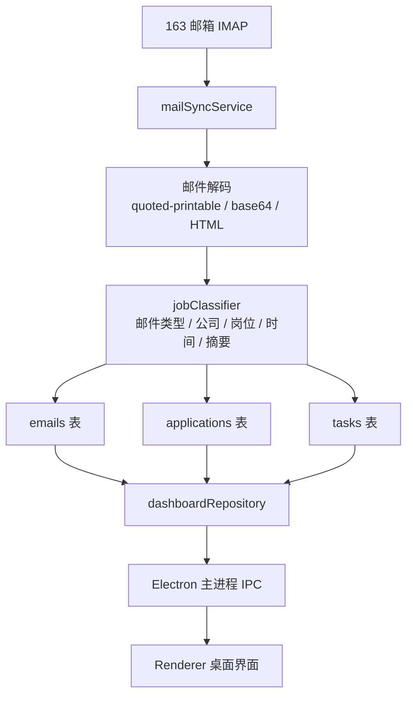

# Job Mail Assistant

本地优先的求职邮件桌面助手。它会从 163 邮箱同步求职相关邮件，自动整理为公司 / 岗位进度、今日摘要和待办清单，并在 Electron 桌面窗口中展示。

## 功能概览

- 连接 163 邮箱 IMAP，同步求职相关邮件
- 规则化识别投递成功、笔试 / 测评、面试、信息补充等邮件类型
- 聚合同公司 / 岗位的邮件进度，生成申请卡片
- 自动生成待办事项，并支持在桌面界面中勾选完成
- 支持手动编辑公司名、岗位名、当前阶段和重要链接
- 重要链接优先用于笔试入口、测评链接、面试会议链接

## 当前技术栈

- 桌面端：Electron
- UI：原生 HTML / CSS / JavaScript
- 数据库：MySQL
- 邮件同步：IMAP (`imapflow`)
- 分类策略：本地规则提取，预留 AI 兜底扩展位

## 项目特点

- 本地运行，不依赖独立后端服务
- 依赖少，适合个人长期维护和渐进扩展
- 数据结构清晰，便于后续接入大模型提取

## 界面能力

- 今日摘要
- 待办清单
- 公司 / 岗位进度
- 重要链接快捷打开
- 手动纠正岗位信息

## 快速开始

### 1. 安装依赖

```bash
npm install
```

### 2. 准备配置

复制一份本地配置：

```bash
copy config.example.json config.local.json
```

填写以下配置：

- `mysql.host`
- `mysql.port`
- `mysql.user`
- `mysql.password`
- `mysql.database`
- `mail.user`
- `mail.password`
- `mail.host`
- `mail.port`
- `mail.secure`
- `mail.initialSyncStartDate`

说明：

- `mail.password` 对 163 邮箱应填写 IMAP 授权密码，不是网页登录密码
- `config.local.json` 已在 `.gitignore` 中，不会被提交

### 3. 初始化数据库

可以直接执行：

```sql
SOURCE sql/schema.sql;
```

或直接启动应用，让程序自动补齐核心表结构。

### 4. 启动应用

```bash
npm start
```

## 配置说明

示例配置见 [config.example.json](./config.example.json)。

重点字段：

- `app.window.width` / `app.window.height`：窗口初始大小
- `app.window.alwaysOnTop`：是否默认置顶
- `mail.initialSyncStartDate`：首次同步起始日期
- `ai.enabled`：预留的 AI 开关，当前默认关闭

## 目录结构

```text
.
├─sql/
│  └─schema.sql
├─src/
│  ├─db/
│  ├─renderer/
│  ├─repositories/
│  ├─services/
│  ├─config.js
│  ├─main.js
│  └─preload.js
├─config.example.json
├─package.json
└─README.md
```

## 核心流程



完整开发说明见 [docs/DEVELOPMENT.md](./docs/DEVELOPMENT.md)，架构图说明见 [docs/ARCHITECTURE.md](./docs/ARCHITECTURE.md)。

## 当前已知限制

- 某些复杂模板邮件仍可能无法稳定提取岗位名
- 最新测评 / 笔试邮件中的时间和入口链接，仍需要继续针对个别模板补强
- 当前主要是规则驱动，尚未接入大模型兜底提取
- 历史数据在公司名归一化后，可能出现同公司多条申请记录需要进一步合并

## 后续可扩展方向

- 增加 AI 兜底提取
- 引入更细的公司名归一化词典
- 增加邮件详情页
- 增加自动定时同步
- 增加导出和备份

## 开发文档

- [开发手册](./docs/DEVELOPMENT.md)
- [模型与流程架构图](./docs/ARCHITECTURE.md)
