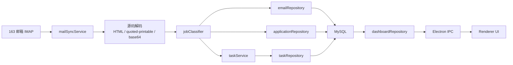
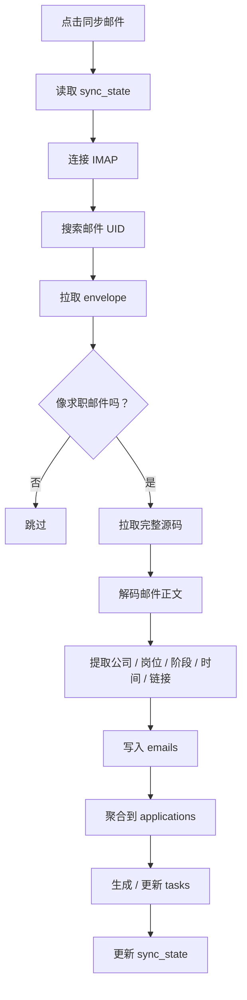
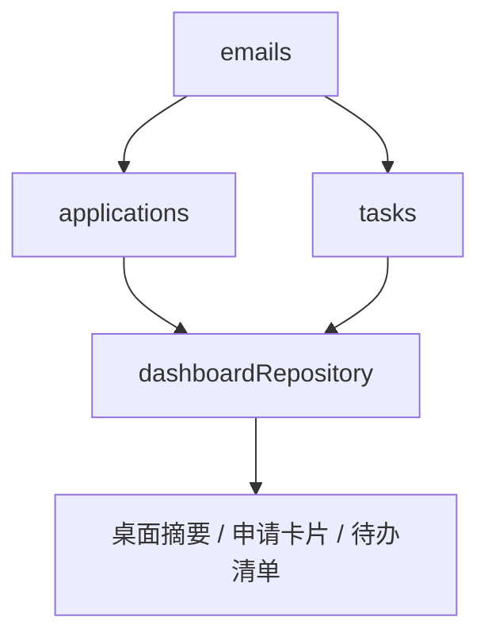
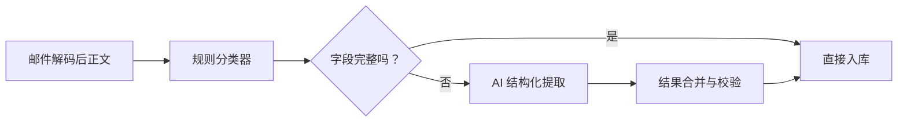

# 模型与流程架构图

## 1. 总体架构

## 2. 同步与分类流程

## 3. 数据聚合视图

## 4. 模块职责

### `mailSyncService`

- 管理 IMAP 连接
- 执行首次同步与增量同步
- 预处理邮件源码
- 提取重要链接

### `jobClassifier`

- 判定是否属于求职邮件
- 识别邮件类型
- 提取公司名、岗位名、关键时间、摘要
- 生成建议动作

### `applicationRepository`

- 维护申请聚合记录
- 支持模糊归并同公司记录
- 支持手动修改

### `dashboardRepository`

- 为首页提供摘要统计
- 输出待办和申请卡片所需字段

### Renderer

- 展示今日摘要
- 展示待办清单
- 展示申请卡片
- 打开重要链接
- 手动修正申请信息

## 5. 未来 AI 兜底位置

推荐接入位置：

建议 AI 只做兜底，而不是替代全部规则逻辑。
